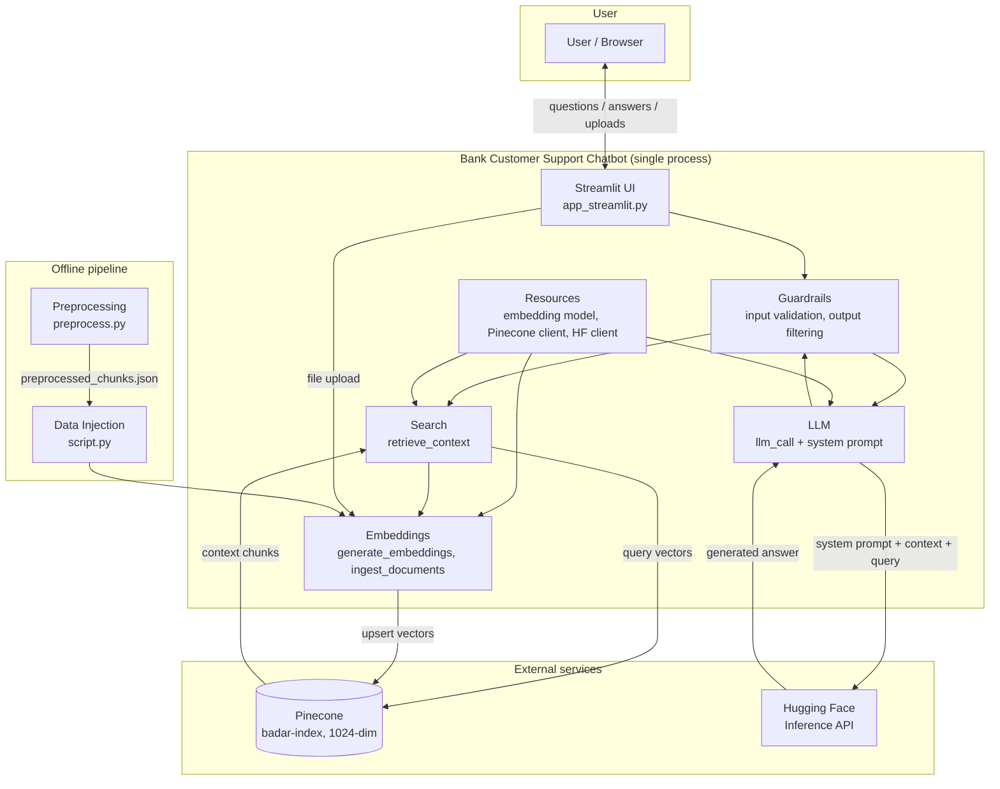
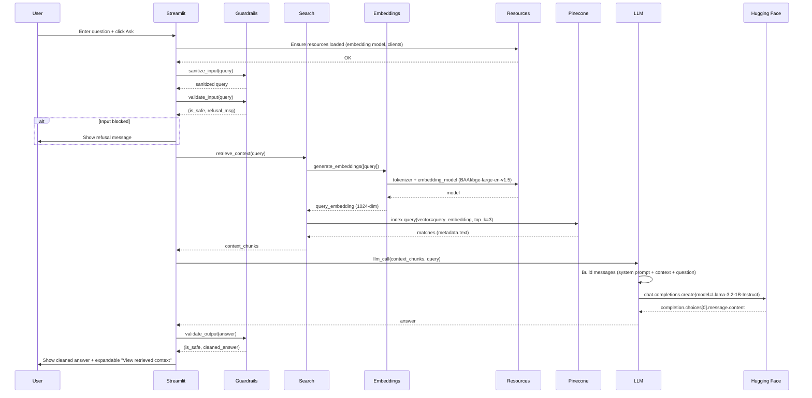
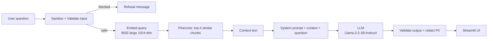
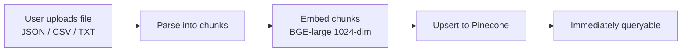
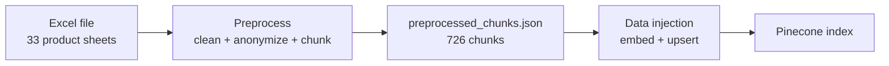
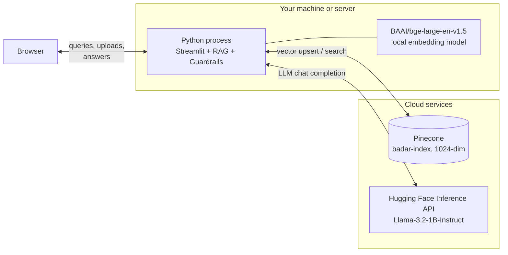

# Bank Customer Support Chatbot — Architecture

This document describes the high-level architecture and request flow. Diagrams use [Mermaid](https://mermaid.js.org/); they render on GitHub, GitLab, and in many Markdown viewers.

---

## 1. Component overview

All components run in a **single process**. There is no separate API server; the Streamlit app drives the UI, applies guardrails, and calls the RAG pipeline directly.

**In words:**

- **Streamlit UI** — Renders the page, captures user questions and file uploads, calls the RAG pipeline, and displays answers with expandable retrieved context.
- **Guardrails** — Three-layer safety: input sanitization & validation (prompt injection, harmful content, off-topic detection), system prompt enforcement, and output validation (PII redaction, harmful content filtering).
- **Resources** — Loaded once at startup via lazy singleton (`get_resources()`): BGE-large embedding model (1024-dim), Pinecone client, and Hugging Face inference client.
- **Embeddings** — Turns text (query or chunks) into 1024-dim vectors using `BAAI/bge-large-en-v1.5`. Also handles real-time ingestion via `ingest_documents()`.
- **Search** — Embeds the query, queries Pinecone for top-3 similar chunks, returns context strings.
- **LLM** — Sends a safety-hardened system prompt + context + question to `meta-llama/Llama-3.2-1B-Instruct` via HuggingFace Inference API.
- **Preprocessing** (offline) — Reads raw Excel, cleans text, anonymizes PII, outputs chunked JSON.
- **Data Injection** (offline) — Loads preprocessed chunks, generates embeddings, upserts to Pinecone.

---

## 2. Request flow (sequence)

When the user clicks **Ask**, the following sequence runs in-process.

---

## 3. Data flow (simplified)

**Query flow (runtime):**

**Upload flow (real-time):**

**Offline preprocessing flow:**

---

## 4. File-to-component mapping

| Layer          | File(s)                                    | Role |
|---------------|---------------------------------------------|------|
| Entry          | `main.py`, `app_streamlit.py`              | Launcher and Streamlit app; loads resources, applies guardrails, handles uploads, and wires UI to RAG. |
| Resources      | `app/services/resources.py`                | Lazy singleton via `get_resources()`: `BAAI/bge-large-en-v1.5` embedding model (1024-dim), Pinecone index (`badar-index`), HuggingFace inference client. |
| Guardrails     | `app/services/guardrails/functions.py`     | `sanitize_input()`, `validate_input()` (prompt injection, harmful, off-topic detection), `validate_output()` (PII redaction, harmful content filtering). |
| Embeddings     | `app/services/embeddings/functions.py`     | `generate_embeddings()`, `upload_embeddings_to_pinecone()`, `ingest_documents()` for real-time upload indexing. |
| Search         | `app/services/search/functions.py`         | `retrieve_context(query)` → embed → Pinecone top-3 query → return context chunks. |
| LLM            | `app/services/llm/functions.py`            | `llm_call(context_chunks, query)` → system prompt + context + question → `Llama-3.2-1B-Instruct` via HuggingFace → return answer. |
| Preprocessing  | `scripts/preprocessing/preprocess.py`      | Reads Excel, cleans text, anonymizes PII, Q&A pairing, outputs `preprocessed_chunks.json` (726 chunks). |
| Data Injection | `scripts/data_injection/script.py`         | Loads preprocessed chunks, generates embeddings, batch upserts to Pinecone. |

---

## 5. Deployment view (single host)

No API gateway or separate backend is required; a single `streamlit run app_streamlit.py` (or `python main.py`) process serves the UI, runs the full RAG pipeline, and applies guardrails. The embedding model runs locally; the LLM and vector DB are cloud services.
