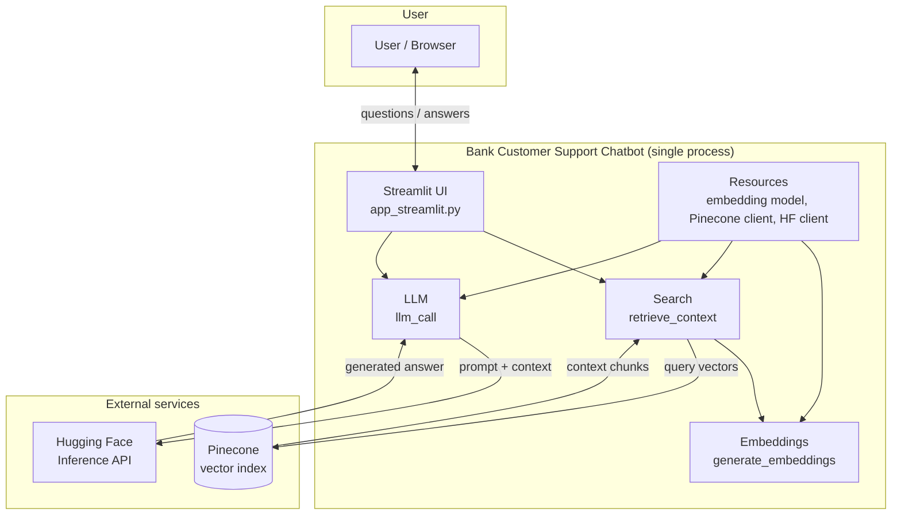
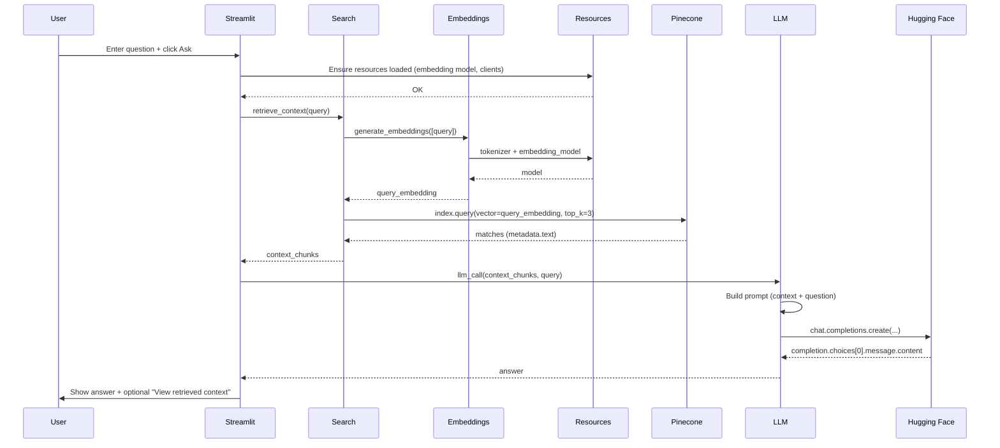
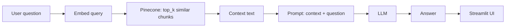
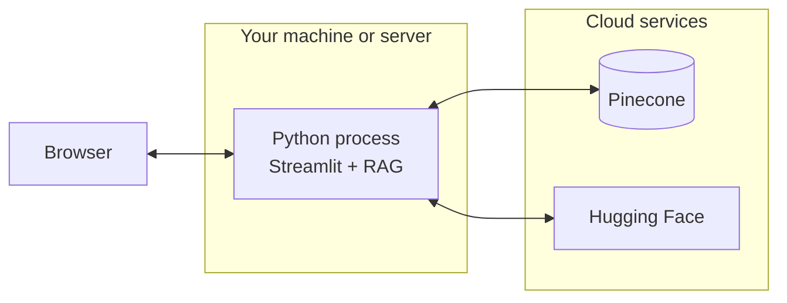

# Bank Customer Support Chatbot — Architecture

This document describes the high-level architecture and request flow. Diagrams use [Mermaid](https://mermaid.js.org/); they render on GitHub, GitLab, and in many Markdown viewers.

---

## 1. Component overview

All components run in a **single process**. There is no separate API server; the Streamlit app drives the UI and calls the RAG pipeline directly.

**In words:**

- **Streamlit UI** — Renders the page, captures the user question, calls the RAG pipeline, and displays the answer (and optional context).
- **Resources** — Loaded once at startup: embedding model (e.g. Gemma), Pinecone client, and Hugging Face inference client.
- **Embeddings** — Turns text (query or chunks) into vectors using the shared embedding model.
- **Search** — Embeds the query, queries Pinecone for similar chunks, returns context strings.
- **LLM** — Builds a prompt from context + question and calls Hugging Face to generate the answer.

---

## 2. Request flow (sequence)

When the user clicks **Ask**, the following sequence runs in-process.

---

## 3. Data flow (simplified)

---

## 4. File-to-component mapping

| Layer        | File(s)                          | Role |
|-------------|-----------------------------------|------|
| Entry       | `main.py`, `app_streamlit.py`     | Launcher and Streamlit app; loads resources and wires UI to RAG. |
| Resources   | `app/services/resources.py`       | Singleton: embedding model, Pinecone index, Hugging Face client. |
| Embeddings  | `app/services/embeddings/functions.py` | `generate_embeddings()`; used by search and (for ingestion) `upload_embeddings_to_pinecone()`. |
| Search      | `app/services/search/functions.py`   | `retrieve_context(query)` → embed → Pinecone query → return context chunks. |
| LLM         | `app/services/llm/functions.py`      | `llm_call(context_chunks, query)` → prompt → Hugging Face → return answer. |

---

## 5. Deployment view (single host)

No API gateway or separate backend is required; a single `streamlit run app_streamlit.py` (or `python main.py`) process serves the UI and runs the full RAG pipeline.
